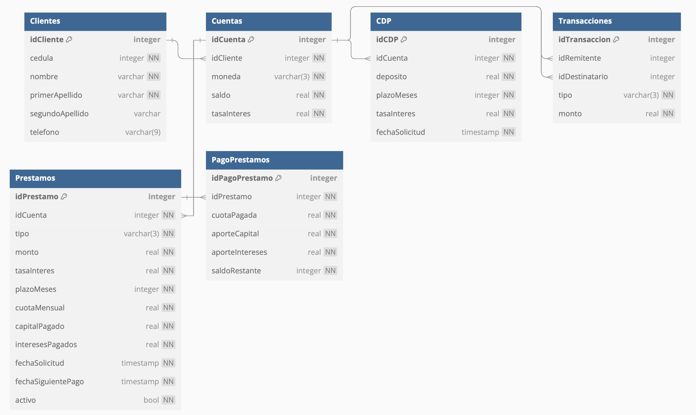

# ie0217-proyecto

Este repositorio fue creado para el curso IE-0217 en el II ciclo del 2024. Contiene el proyecto final del curso correspondiente a la implementación de un sistema de gestión utilizado por los agentes de atención al cliente en ventanillas de una entidad bancaria. 

El repositorio pertenece al grupo 6 que contiene a los siguientes integrantes:

|        **Integrantes**       | **Carné** |
|:---------------------------:|:---------:|
|   Rodrigo Madrigal Montes   |   C24458  |
| Daniel Alberto Sáenz Obando |   C37099  |

## Fase 1: Investigación

En esta sección se define el concepto, funcionamiento y características de los componentes básicos de un sistema de gestión bancaria en ventanilla, que son la base sobre la que se desarrollará las distintas funcionalidades, implementación y diseño del proyecto en cuestión.

### Préstamos

Inicialmente, se tiene que un préstamo consiste en un producto financiero que permite a un usuario acceder a una cantidad fija de dinero al comienzo de la operación. Además, esta debe ser devuelta junto a unos intereses pactados en un plazo determinado. Por lo general, la amortización del préstamo se realiza mediante cuotas mensuales.[[1]](#bibliografía)

Con base en la definición anterior, es importante definir que es un préstamo garantizado y no garantizado, lo cual se realiza en las subsecciones siguientes. Posteriormente, se muestran los tipos de préstamos que van a ser contemplados en el proyecto.

#### Préstamos garantizados 

Es aquel que se otorga con base en algún tipo de garantía a modo de respaldo, que puede ser una propiedad, un bien material o un aval financiero como un depósito bancario, acciones o similares.[[2]](#bibliografía)

El punto es que la garantía se usa para asegurarse que el prestamista (entidad bancaria) recupere el dinero prestado en caso de que el deudor (cliente) no pueda pagar.

Este tipo de préstamos tienen una tasa de intéres más baja que los no garantizados y plazos de pago más largos, lo cual hace que los pagos mensuales sean menores. 

#### Préstamos no garantizados 

Para solicitar estos préstamos no se requiere de ninguna garantía más que la solvencia del deudor para pagar, pero presenta un riesgo para el prestamista ya que no hay forma de asegurarse de que el deudor vaya a pagar. Por este mismo riesgo para el prestamista estos préstamos suelen pactarse con periodos de pago más cortos y a una tasa de intéres mucho mayor.[[2]](#bibliografía)

#### Préstamos personales

Con respecto al primer tipo de préstamo contemplado en el proyecto, se tiene que este es **no garantizado**, en el que se presta una cantidad específica de dinero a una persona, con la promesa de devolverlo en cuotas regulares. Es comúnmente utilizado para gastos personales, como la compra de electrodomésticos, viajes o consolidación de deudas[[3]](#bibliografía).

La información requierida para estimar el pago de este tipo de préstamos es la siguiente:

- **Monto solicitado**: Cantidad de dinero que se desea pedir prestado.
- **Plazo**: Período de tiempo en el que se pagará el préstamo (en meses).
- **Tasa de interés**: Porcentaje anual que se aplica al monto del préstamo.

#### Préstamo prendario

Es un préstamo que está **garantizado** por un bien mueble, como un vehículo o joyas. En caso de incumplimiento de pago, el banco puede tomar posesión del bien en garantía.[[4]](#bibliografía)

Como se mencionó antes, estos tiene una tasa de interés más baja que los no garantizados porque hay una garantía física de que el deudor no incumplirá los pagos. 

La información que se requiere para estimar el pago es la misma que el préstamo personal, pero se debe asegurar que el bien que se ha dado como garantía tenga el mismo valor o superior al valor del préstamo en caso de que no sea el bien mismo.[[4]](#bibliografía)

#### Préstamo hipotecario

Es un préstamo que se **garantiza** con una propiedad inmueble, como una casa o terreno. Se utiliza comúnmente para la compra, construcción o remodelación de bienes raíces.[[5]](#bibliografía)

Para calcular el pago de este tipo de préstamos se requiere:

- **Valor de la propiedad**: Valor estimado del inmueble que servirá como garantía.
- **Monto solicitado**: El dinero se quiere pedir prestado para la compra o construcción.
- **Plazo**: Tiempo en el que se pagará el préstamo (suele ser más largo que otros préstamos, por ejemplo, 15 a 30 años).
- **Tasa de interés**: Porcentaje aplicado sobre el monto del préstamo, que puede ser fija o variable.

#### ¿Cómo se calculan los montos de las cuotas de pago y los intereses para préstamos?

En las secciones anteriores, se mencionaron las cuotas e intereses de un préstamo. Sin embargo, para calcular estos valores se tienen fórmulas específicas, las cuales se detallan a continuación.

##### Cuotas mensuales

El pago de cada cuota mensual para cualquiera de los préstamos anteriores se calcula con base en la siguiente fórmula:

$$C=\frac{P\cdot i\cdot (1+i)^n}{(1+i)^n-1}$$

Donde:

- $C$: cuota mensual.
- $P$: monto del préstamo.
- $i$: tasa de interés mensual.
- $n$: número total de meses de pago.

##### Intereses

Existen dos tipos de intereses: **fijos** y **variables**. 

Si la tasa de interés es fija en el plazo del préstamo, significa que este será constante a lo largo de la duración del préstamo. Este se define en un plazo anual y en la fórmula anterior se ingresa el mensual, entonces el valor de interés que va en la fórmula de la sección anterior es:

$$i=\frac{i_A}{12}$$

$i_A$ es la tasa de interés anual que normalmente se define como un porcentaje, por ejemplo $15\%$ o $12\%$. Ahora bien si el interés es variable significa que este valor cambia con base en el saldo pendiente del préstamo en cuestión, de la siguiente manera:

$$i_V=\text{Saldo pendiente del préstamo} \times i$$

Donde $i_V$ es la tasa de interés variable en cada cuota, e $i$ es la tasa de interés que se definió para la duración de todo el préstamo. Entonces si se tiene una tasa de interés variable en un préstamo su pago en cada cuota se calcula así:

$$C=\frac{P\cdot i_V\cdot (1+i_V)^n}{(1+i_V)^n-1}$$

Todos lo préstamos pueden tener tasas de intéres variable o fija.[[7]](#bibliografía)

#### Abonos a Préstamos

Un abono extraordinario a préstamos consiste en el pago de cuotas adicionales antes de su tiempo programado.

Es importante mencionar que dependiendo del tipo de acuerdo que se tenga del préstamo de la entidad bancaria, pueden existir penalizaciones o limitaciones a la hora de realizar los abonos extraordinarios. En el caso de la implementación actual no se van a aplicar estas limitaciones.

Ahora bien, al realizar abonos al préstamo hay dos posibilidades: se reduce la vida del préstamo (plazo en meses restantes) o se reduce el monto de la cuota mensual. En la aplicación se va a permitir escoger cuál opción se prefiere.[8](#bibliografía)

Para realizar los abonos al préstamo, se va a almacenar la siguiente información:

- Identificador del pago del préstamo (ID).
- Identificador del préstamo.
- Cuota pagada.
- Aporte al capital.
- Aporte a los intereses.
- Saldo restante del préstamo.

Guardar el saldo del préstamo es realizado como un mecanismo de seguridad para rastrear la correcta reducción del préstamo y reducir la posibilidad de que ocurran irregularidades.

### Cuentas de Ahorros

Es una cuenta bancaria que permite a una persona depositar dinero para ahorrarlo y ganar intereses sobre el saldo. Las cuentas de ahorro suelen tener menos requisitos que otros tipos de cuentas y son accesibles para la mayoría de las personas. La información requerida para abrir una cuenta de ahorro comúnmente es:

- Identificador del cliente (cédula o pasaporte).
- Nombre y apellidos del cliente.
- Comprobante de domicilio.
- Teléfono
- Monto mínimo de apertura (dependiendo del banco).
- Tasa de interés sobre saldo promedio.[[9]](#bibliografía)

Esta tasa de interés en las cuentas de ahorro se calcula diariamente por medio de la siguiente fórmula:

$$I_D=\frac{\text{Saldo al final del día}\times i}{365}$$

Donde $i$ es la tasa de interés de la cuenta de ahorro e $I_D$ es el valor diario de interés que se suma a la cuenta.[[10]](#bibliografía)

### Certificado de depósito a plazo (CDP)

Es un tipo de inversión en la que se deposita una cantidad de dinero durante un período fijo, y el banco paga intereses sobre el monto al final del plazo. El dinero no puede retirarse antes de la fecha de vencimiento sin incurrir en penalizaciones.[[11]](#bibliografía)

La información requerida para abrir un CDP se muestra a continuación:

- Identificador del cliente (ID).
- Monto mínimo de inversión (varía según el banco).
- Plazo del depósito (en meses o años).
- Tasa de interés pactada.

Se puede calcular el monto de interés ganado al vencimiento del CDP por medio de la siguiente fórmula:

$$I = P\cdot i \cdot t$$ 

Las variables anteriores corresponden a:

- $I$: interés ganado.
- $P$: monto del CDP.
- $i$: tasa de interés anual.
- $t$: tiempo de duración del CDP, en años.[[12]](#bibliografía)

Cabe mencionar que $i$ se calcula igual que como se explicó para los préstamos.

Respecto a la información que se almacena en el sistema al solicitar/vencer un CDP, se guardan los siguientes datos:

- Identificador del CDP.
- Monto del capital.
- Intereses generados.

### Depósitos y retiros de dinero

En primer lugar, __depositar dinero__ en una entidad bancaria consiste en la acción de entregar dinero al banco para que lo almacene y lo inmovilice, a cambio de recibir una rentabilidad por ese dinero (en forma de intereses).[[13]](#bibliografía).

Para realizar un depósito de dinero, se requiere especificar el identificador de la cuenta bancaria a la que se desea ingresar el monto, así como el número de cédula del cliente de la cuenta, a modo de doble comprobación de los datos y asegurar que la cuenta realmente pertenece al cliente en cuestión.

Para el almacenamiento de la información del depósito, se guardan los siguientes datos:

- Identificador de la transacción (ID).
- Identificador de la cuenta a la que se depositó el dinero.
- Monto de dinero ingresado.

En segundo lugar, un __retiro bancario__ corresponde a una operación financiera, mediante la cual un cliente extrae fondos de su cuenta, para utilizarlos en transacciones de pago, inversión, consumo, entre otros.[[14]](#bibliografía)

Esta es una operación común para realizar en una ventanilla, especialmente al retirar considerables sumas de dinero (que excedan el límite de un cajero automático). Por lo que, para realizar retiro es necesario indicar la cédula (identificación de la persona) y el número de la cuenta sobre la cual desea retirar el dinero.

Dependiendo del retiro, se pueden aplicar comisiones que no van a ser tomadas en cuenta en la implementación actual del proyecto.

En cuanto a la información que se va a almacenar en el sistema del movimiento actual, se tiene lo siguiente:

- Identificador de la transacción (ID).
- Identificador de la cuenta sobre la que se realizó el retiro.
- Monto de dinero retirado.

### Transferencias entre cuentas

Una transferencia corresponde al envío de fondos de una cuenta a otra (puede ser del mismo banco o de terceros). Para efectos del proyecto, es importante mencionar que las transacciones se deben dar en cuentas de la misma moneda.

En cuanto a los datos requeridos para realizar una transacción, se requiere el identificador (ID) de la cuenta del destinatario y su número de cédula. Esto tiene el propósito de realizar una doble verificación de que la cuenta pertenece a la persona indicada.[[15]](#bibliografía)

Además, para efectos de la información que se va a guardar en el sistema, se almacenan:

- Identificador de la transacción (ID).
- Identificador de la cuenta remitente.
- Identificador de la cuenta destinataria.
- Monto transferido.

Dependiendo del contexto de la transferencia, ciertos bancos aplican un porcentaje de comisión respecto al total transferido. Sin embargo, en cuanto a los alcances del proyecto actual, esta variable va a ser tomada en consideración.

### Confidencialidad de la información del banco

Observe que en las transacciones mencionadas anteriormente, se establece como prioridad la confidencialidad de la información de los clientes. Únicamente se pueden realizar las transacciones si es el cliente el que proporciona la información correcta, no se sugieren cambios o correcciones a los valores ingresados por el cliente para la protección de datos. 

Como establece el _Manual de buenas prácticas para el manejo de los datos personales de los clientes de los servicios financieros_ de la Cámara de Bancos e Instituciones Financieras de Costa Rica, la entidad financiera debe guardar secreto de todos los datos que manejen de sus clientes salvo que se encuentre dentro de las excepciones estipuladas en la Ley. Además, las entidades financieras deben proteger y utilizar adecuadamente cualquier dato o información confidencial que les suministren sus clientes. Ésta deberá ser utilizada de manera exclusiva para el propósito por el cual fue requerida.[[16]](#bibliografía)

Por lo tanto, el propósito del proyecto actual es que se rija basándose en el párrafo anterior; es decir, priorizando la privacidad de los clientes en la entidad bancaria.

## Fase 2: Diseño

En la sección de diseño del proyecto, se desarrollan las bases sobre las cuales se va a realizar la implementación de la aplicación en cuestión.

### Diseño de base de datos

Como se mencionó anteriormente, la base de datos que se va a utilizar en el proyecto corresponde a SQLite. Para simular datos dentro de la base de datos, se crea un script que los ingresa cuando se clona el presente repositorio en un dispositivo nuevo. Esto se detalla a profundidad en la guía de uso de la aplicación.

Ahora bien, en cuanto al diseño dentro de la base de datos, se plantea la implementación mostrada a continuación:

  

> [!IMPORTANT]
> El símbolo de llave al lado del nombre de campo de la tabla indica que es una llave primaria. Además, cuando aparece `NN` en los campos, indica que el valor no puede ser nulo.

En esta, se incluyen las tablas a continuación:

- __`Clientes`__: Tabla que guarda la información propia de cada cliente.
    - __Clave primaria__ `idCliente`: Identificador único del cliente. Se genera automáticamente por la base de datos. 
    - `cedula`: Número de identificación del cliente dado por el Registro Nacional (único). Utilizado para acceder a la información del cliente.
    - `nombre`: Nombre del cliente.
    - `primerApellido`: Primer apellido del cliente.
    - `segundoApellido`: Segundo apellido del cliente. 
    - `telefono`: Medio de comunicación con el cliente.

> [!NOTE]
> Dependiendo de la implementación, también es usual que las entidades bancarias almacenen domicilio y correo electrónico. Sin embargo, para efectos del proyecto, se almacena únicamente el número telefónico.

- __`Cuentas`__: Tabla que guarda la información de cada cuenta de ahorro en la aplicación.
    - __Clave primaria__ `idCuenta`: Identificador único de la cuenta bancaria de ahorros. Se genera automáticamente por la base de datos
    - __Clave foránea__ `idCliente`: Identificador único del cliente referenciado de la tabla `Clientes`.
    - `moneda`: Tipo de moneda de la cuenta (`USD` o `CRC`).
    - `saldo`: Cantidad de dinero almacenado en la cuenta.
    - `tasaInteres`: Tasa de interés que gana la cuenta diariamente.

> [!NOTE]
> Para los campos que poseen valores numéricos con decimales, se utiliza el tipo de dato `REAL`. Se van a manejar dos decimales como es generalmente en los bancos.

- __`Prestamos`__: Tabla que guarda la información de cada préstamo bancario.
    - __Clave primaria__ `idPrestamo`: Identificador único del préstamo. Generado de forma automática por la base de datos.
    - __Clave foránea__ `idCuenta`: Identificador de la cuenta bancaria asociada al préstamo.
    - `tipo`: Tipo de préstamo (`PER`: personal, `HIP`: hipotecario, `PRE`: prendario).
    - `tasaInteres`: Tasa de interés asociada al préstamo. Se va a manejar una tasa de interés fija para los préstamos.
    - `plazoMeses`: Plazo total en meses del préstamo.
    - `cuotaMensual`: 
    - `totalPagado`: 
    - *`plazoRestante`: 
    - *`total a pagar`: 
    - *`interes a pagar`: 
    - *`interes pagado`: 
    - *`fecha vencimiento/solicitud`: 

- __`PagoPrestamos`__: Tabla que guarda un registro del pago de los préstamos dentro de la entidad bancaria.
    - __Clave primaria__ `idPagoPrestamo`: Identificador único del préstamo. Generado automáticamente por la base de datos.
    - __Clave foránea__ `idPrestamo`: Identificador del préstamo asociado al pago.
    - `cuotaPagada`: Cuota pagada del préstamo.
    - `aporteCapital`: Aporte realizado al capital del préstamo.
    - `aporteIntereses`: Aporte realizo a los intereses del préstamo.
    - `saldoRestante`: Saldo restante por pagar (como forma de rastreo de los pagos anteriores y evitar irregularidades).

- __`Transacciones`__: Tabla que guarda un registro de las transacciones que se han realizado dentro de las cuentas.
    - __Clave primaria__ `idTransaccion`: Identificador único de la transacción realizada.
    - __Clave foránea__ `idRemitente`: Hace referencia a la cuenta sobre la que se obtuvieron los fondos para la transacción (ID de la cuenta).
    - __Clave foránea__ `idDestinatario`: Hace referencia a la cuenta a la que se depositaron los fondos para la transacción (ID de la cuenta).
    - `tipo`: Tipo de transacción (`TRA`: transferencia, `RET`: retiro, `DEP`: Depósito).
    - `monto`: Monto de dinero movido en la transacción.

> [!NOTE]
> En esta tabla, se manejan 3 tipos de movimientos: transferencias, retiros y depósitos (identificados por el tipo). Cuando se realiza un retiro, `idDestinatario` es nulo; mientras que, cuando se realiza un depósito, `idRemitente` es nulo.

- __`CDP`__: Tabla que almacena la información de los certificados de depósito a plazo.
    - __Clave primaria__ `idCDP`: Identificador único del CDP. Generado automáticamente por la base de datos,
    - __Clave foránea__ `idCuenta`: Cuenta asociada al CDP.
    - `deposito`: Monto destinado para el CDP por el cliente.
    - `plazoMeses`: Plazo en meses de vigencia del CDP.
    - `tasaInteres`: Tasa de interés asociada al CDP.
    - `fechaSolicitud`: Fecha de registro del CDP por parte del usuario.

### Reportes de transacciones

Normalmente cada transacción tiene información distinta en sus reportes, pero hay varios datos básicos que debe incluir cualquier reporte:

- ID de Transacción: Identificador único

- Tipo de Transacción: Depósito, retiro, transferencia, abono a préstamo

- Monto: Importe de la transacción

- Cuenta de Origen: ID de la cuenta que origina la transacción

- Cuenta de Destino (si aplica): ID de la cuenta que recibe la transacción en caso de que sea una transferencias o abonos

- Cliente Asociado: ID del cliente que ejecutó la transacción

Ahora bien, hay datos específicos que se deben tener para cada tipo de transacción:

#### Depósitos y Retiros

- Saldo anterior

- Saldo actual después de la transacción

#### Transferencias

- ID del cliente receptor de la transferencia

#### Abonos a Préstamos

- ID del préstamo

- Cuota pagada

- Aporte al capital

- Aporte a los intereses

- Saldo restante del préstamo

#### Pago al vencer un CDP

- ID del CDP

- Monto del capital

- Intereses generados

PENDIENTE AGREGAR A LA LISTA DE LOGS

## Cronograma

## Bibliografía

\[1\]: Banco Santander, _¿Qué diferencias hay entre un préstamo y un crédito?_. Banco Santander. Accedido el 22 de octubre de 2024. [En línea]. Disponible: https://www.bancosantander.es/faqs/particulares/prestamos/diferencias-prestamo-credito#:~:text=Un%20préstamo%20es%20un%20producto,realiza%20mediante%20unas%20cuotas%20regulares

\[2\]: Banco Santander. _Préstamo garantizado vs Préstamos no garantizados_. Santander Consumer. Accedido el 19 de octubre de 2024. [En línea]. Disponible: https://www.santanderconsumer.es/blog/post/prestamo-garantizado-vs-prestamos-no-garantizados

\[3\]: Caja de ANDE. _Préstamos Personales_. Caja de ANDE. Accedido el 19 de octubre de 2024. [En línea]. Disponible: https://www.cajadeande.fi.cr/servicios/préstamos/préstamos-personales/

\[4\]: Banco de Costa Rica. _Vehículo Nuevo Motos y Afines_. Banco Nacional de Costa RIca. Accedido el 19 de octubre de 2024. [En línea]. Disponible: https://www.bancobcr.com/wps/portal/bcr/bancobcr/personas/creditos/creditos_para_vehiculos/vehiculo_nuevo_motos_y_afines/

\[5\]: Banco Nacional de Costa Rica. _Préstamos Para Vivienda_. Banco Nacional de Costa Rica. Accedido el 19 de octubre de 2024. [En línea]. Disponible: https://www.bncr.fi.cr/personas/financiamiento/prestamo-para-vivienda

\[6\]: BAC Credomatic. _Fórmulas y Ejemplos de Préstamos Hipotecarios_. BAC Credomatic. Accedido el 19 de octubre de 2024. [En línea]. Disponible: https://www2.baccredomatic.com/sites/default/files/ni_formulas_y_ejemplos_de_prestamos_hipotecarios-_sitio_web_2020.pdf

\[7\]: Banco Nacional de Costa RIca. _Calculadoras_. Banco Nacional de Costa RIca. Accedido el 20 de octubre de 2024. [En línea]. Disponible: https://www.bncr.fi.cr/personas-calculadoras-old

\[8\]: W. Soto, _Abonos extraordinarios a préstamos, ¿reducción de cuota o tiempo?_. ProUsuario, 2022. https://prousuario.gob.do/educacion-financiera/blog/abonos-extraordinarios-a-préstamos-reducción-de-cuota-o-tiempo/

\[9\]: Banco de Costa Rica. _Cuenta de ahorro_. Banco BCR. Accedido el 20 de octubre de 2024. [En línea]. Disponible: https://www.bancobcr.com/wps/portal/bcr/bancobcr/personas/cuentas/ahorro

\[10\]: BAC Credomatic. _Guía para calcular interés diario y mantenimiento de valor para cuentas de ahorro_. BAC Credomatic. Accedido el 20 de octubre de 2024. [En línea]. Disponible: https://www2.baccredomatic.com/sites/default/files/calculointerescuentaelectronica.pdf

\[11\]: Banco Popular. _Ahorro a Plazo_. Banco Popular. Accedido el 20 de octubre de 2024. [En línea]. Disponible: https://www.bancopopular.fi.cr/ahorro/ahorro-a-plazo/

\[12\]: Banco Popular. _Calculadora Certificados Capitalizables_. Banco Popular. Accedido el 20 de octubre de 2024. [En línea]. Disponible: https://www.bancopopular.fi.cr/calculadora-certificados-capitalizables/

\[13\]: BillIn. _¿Qué es depositar?_. BillIn. Accedido el 22 de octubre de 2024. [En línea]. Disponible: https://www.billin.net/glosario/definicion-depositar/

\[14\]: Rankia España. _Retiro bancario_. Rankia: Comunidad financiera. Accedido el 22 de octubre de 2024. [En línea]. Disponible: https://www.rankia.com/diccionario/banca/retiro-bancario

\[15\]: Banco de Costa Rica. _Transferencias_. Banco BCR. Accedido el 22 de octubre de 2024. [En línea]. Disponible: https://www.bancobcr.com/wps/portal/bcr/bancobcr/personas/servicios_personas/transferencias/

\[16\]: Cámara de Bancos e Instituciones Financieras de Costa Rica. _Manual de buenas prácticas para el manejo de los datos personales de los clientes de los servicios financieros_, 2015. 
