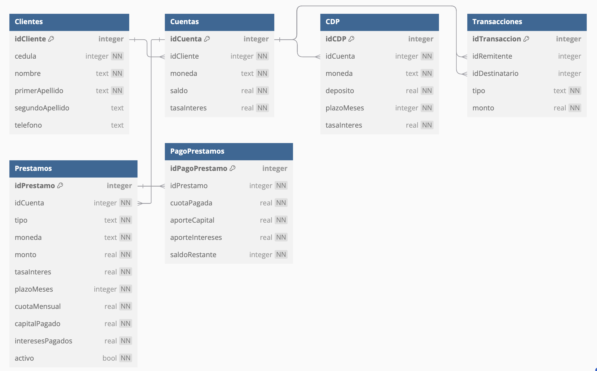
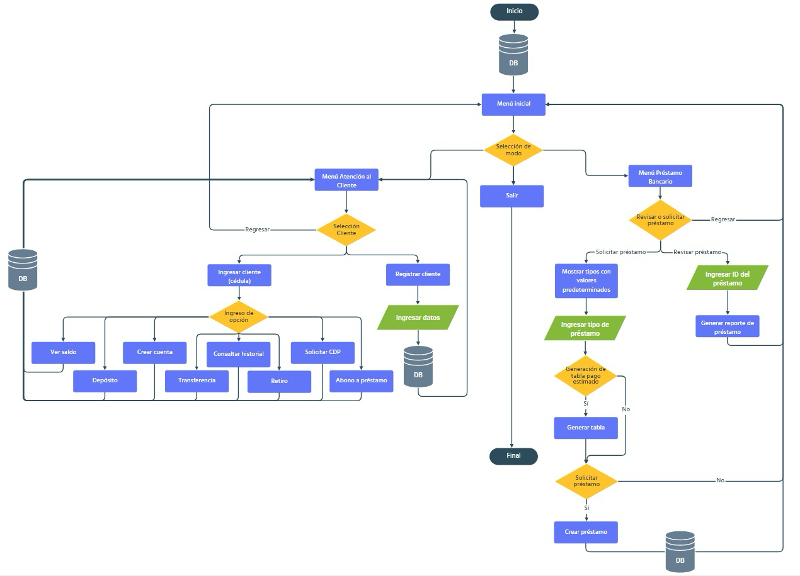

# ie0217-proyecto

Este repositorio fue creado para el curso IE-0217 en el II ciclo del 2024. Contiene el proyecto final del curso correspondiente a la implementación de un sistema de gestión utilizado por los agentes de atención al cliente en ventanillas de una entidad bancaria. 

El repositorio pertenece al grupo 6 que contiene a los siguientes integrantes:

<div align="center">

|        **Integrantes**       | **Carné** |
|:---------------------------:|:---------:|
|   Rodrigo Madrigal Montes   |   C24458  |
| Daniel Alberto Sáenz Obando |   C37099  |

</div>


## Progreso del avance

Para este avance nos guíamos por las tareas y fechas que se definieron previamente en el [cronograma](#cronograma) para esta sección. Primero antes de empezar a implementar el código de las funciones y clases necesarias definimos que los archivos se dividirían en tres directorios:

- `include` que contendrá los archivos de encabezado 

- `src` que contendrá los archivos de implementación 

- `utils` que contendrá archivos de funciones auxiliares a la implementación del programa principal

Teniendo este orden definido se procedió a implementar los siguientes archivos primero en la carpeta `include`:

- `CDP.hpp`: Declaración de la clase `CDP` con sus atributos correspondientes, el constructor de la misma, el método `crear` para crear un CDP en la base de datos y el método `obtener` para mostrar los datos de un CDP de la base de datos. 

- `Cliente.hpp`: Declaración de la clase `Cliente` con sus atributos correspondientes, el constructor de la clase, el método `crear` para crear un cliente en la base de datos y el método `obtener` para obtener un cliente de la base de datos, método `existe` para verificar la existencia de un cliente y los métodos `getCedula` y `getID` para obetener la cédula y el ID de un cliente respectivamente.

- `Cuenta.hpp`: Declaración de la clase Cuenta con sus atributos correspondientes, el constructor de la clase, y los siguientes métodos:

  - `crear`: Crea un nuevo registro de cuenta en la base de datos.
  - `obtener`: Recupera una cuenta específica desde la base de datos usando su identificador.
  - `existe`: Verifica si una cuenta existe en la base de datos.
  - `getID`: Devuelve el identificador único de la cuenta.
  - `getIDCliente`: Retorna el identificador del cliente asociado a la cuenta.
  - `verSaldo`: Consulta el saldo actual de la cuenta.
  - `depositar`: Realiza un depósito en la cuenta y actualiza el saldo en la base de datos.
  - `retirar`: Realiza un retiro de la cuenta si hay fondos suficientes.
  - `transferir`: Transfiere fondos a otra cuenta si ambas tienen la misma moneda.
  - `abonarPrestamo`: Permite realizar un abono a un préstamo desde la cuenta.
  - `solicitarCDP`: Solicita un Certificado de Depósito a Plazo, disminuyendo el saldo de la cuenta.
  - `consultarHistorial`: Consulta y muestra el historial de transacciones de la cuenta.
  - `actualizarSaldo`: Modifica el saldo de la cuenta en la base de datos.
  - `existeSegunMoneda`: Verifica si existe una cuenta con la misma moneda para el cliente.
  - `verificarFondos`: Comprueba que el saldo sea suficiente para una operación.
  - `crearTransaccion`: Inserta un registro de transacción en la base de datos.
  - `verificarCompatibilidadMoneda`: Asegura la compatibilidad de moneda para transferencias entre cuentas.

- `Database.hpp`: Declaración de la clase Database con los siguientes elementos:

  - `Constructor`: Inicializa y abre la conexión a la base de datos especificada.
  - `Destructor`: Cierra la conexión a la base de datos al destruir el objeto.
  - `get`: Retorna un puntero a la conexión de la base de datos SQLite.

- `Menu.hpp`: Declaración de funciones para la gestión de los menús del programa:
  - `mostrarMenuPrincipal`: Despliega el menú principal, permitiendo al usuario seleccionar entre opciones de atención al cliente, información sobre préstamos bancarios o salir de la aplicación.
  - `menuAtencionCliente`: Permite la interacción en el menú de atención al cliente, donde el usuario puede iniciar sesión con un cliente existente o registrar uno nuevo en la base de datos.
  - `menuOperacionesCliente`: Permite realizar diversas operaciones para un cliente autenticado, incluyendo ver saldo, consultar historial de transacciones, solicitar un CDP, realizar abonos a préstamos, depósitos, transferencias y retiros.

- `Transaccion.hpp`: Declaración de la clase Transaccion para gestionar operaciones financieras:
  - Atributos:
      - `idRemitente`: ID de la cuenta remitente.
      - `idDestinatario`: ID de la cuenta destinataria.
      - `tipo`: Tipo de transacción (DEP para depósito, RET para retiro, TRA para transacción, ABO para abono, CDP para certificado de depósito a plazo).
      - `monto`: Monto de la transacción.
  - Métodos:
      - `Transaccion`: Constructor que inicializa una transacción con el remitente, destinatario, tipo de operación y monto.
      - `procesar`: Ejecuta la transacción en la base de datos, registrando los detalles y, dependiendo del tipo, modifica los saldos de las cuentas involucradas. Retorna true si la operación es exitosa o false en caso de error.

- `auxiliares.hpp`: Declaración de funciones auxiliares para validación y cálculos básicos:
    - `validarFecha`: Solicita una fecha al usuario en formato YYYY-MM-DD y verifica que cumpla con el formato y los límites de días y meses.
    - `obtenerEntero`: Solicita un número entero positivo al usuario, validando que la entrada sea válida.
    - `obtenerDecimal`: Solicita un número decimal positivo al usuario, validando la entrada.
    - `validarMoneda`: Presenta opciones de moneda al usuario (USD ó CRC) y valida la selección.
    - `validarTelefono`: Solicita un número de teléfono en el formato (####-####) y verifica que cumpla con el formato.
    - `potencia`: Calcula la potencia de un número base elevado a un exponente entero positivo (n^p).

- `constants.hpp`: Declaración de enumeraciones que representan las opciones en los diferentes menús de la aplicación:
    - `MenuPrincipalOpciones`: Enumera las opciones del menú principal de la aplicación:
        - `ATENCION_CLIENTE`: Ir al menú de atención al cliente.
        - `PRESTAMO_BANCARIO`: Acceder a información sobre préstamos bancarios.
        - `SALIR`: Salir de la aplicación.
    - `MenuAtencionClienteOpciones`: Enumera las opciones del menú de atención al cliente:
        - `INICIAR_SESION`: Iniciar sesión con un cliente existente.
        - `REGISTRAR_CLIENTE`: Registrar un nuevo cliente.
        - `REGRESAR`: Regresar al menú principal.
    - `OperacionesCliente`: Enumera las opciones del menú de operaciones para un cliente autenticado:
        - `VER_SALDO`: Ver el saldo de la cuenta.
        - `CONSULTAR_HISTORIAL`: Consultar el historial de transacciones.
        - `SOLICITAR_CDP`: Solicitar un Certificado de Depósito a Plazo (CDP).
        - `ABONO_PRESTAMO`: Realizar un abono a un préstamo.
        - `DEPOSITO`: Realizar un depósito en la cuenta.
        - `TRANSFERENCIA`: Realizar una transferencia a otra cuenta.
        - `RETIRO`: Retirar fondos de la cuenta.
        - `REGRESAR`: Regresar al menú de selección de cuenta.


Ahora bien los archivos que se encuentran en la carpeta `src` contienen la implementación de todas las funciones descritas anteriormente además del `main.cpp` que es el archivo principal de la implementación de todo el programa. Y por último los archivos en la carpeta `utils` son:

- `auxiliares.cpp`: Contiene la implementación de las funciones declaradas en `auxiliares.hpp`

- `inicio_db.cpp`: Contiene las instrucciones para inicializar la base de datos con registros preestablecidos

Y por fuera de los directorios anteriores se implementó el `Makefile` que contiene las reglas e instrucciones para compilar y ejecutar los archivos necesarios para la ejecución del programa. 

Si bien se incluyen los archivos de `Prestamo.hpp` y `PagoPrestamo.hpp` en la entrega y en el `Makefile` la implementación de los mismos y por tanto todas las funcionalidades del programa relacionada con los préstamos queda pendiente para el avance final del proyecto. Y además es importante mencionar que la implementación del menú principal es una versión preliminar para mostrar la ejecución de este avance, ya que en el cronograma se tenía planeado que esta parte se implementara al final del proyecto. 

Como conclusión se lograron llevar a cabo los avances planteados para este avance y se espera concluir con las demás asiganciones en el orden y fechas especificadas en el [cronograma](#cronograma). 


## Instrucciones de compilación y ejecución

Para compilar los archivos de este proyecto se utilza un `Makefile`, que generará dos ejecutables: `sistemaGestionBancaria` e `iniciar_db`. Cabe mencionar que este `Makefile` funciona tanto en sistema operativo `Windows` como `Linux`, y hay dos opciones para compilar y ejecutar este proyecto:

### Opción de compilación 1

Para compilar y ejecutar ambos archivos se utiliza el siguiente comando:

```
make run
```

Por medio de este comando se compilan ambos ejecutables en la carpeta `build` y ejecuta primero `iniciar_db` ya que este archivo inicializa la base de datos con registros preestablecidos; y posteriormente se ejecuta `sistemaGestionBancaria` que ya contiene toda la operación de programa principal. 

### Opción de compilación 2

Para compilar ambos archivos se debe ejecutar el siguiente comando:

```
make
```

Esto generará ambos ejecutables en la carpeta `build`. Y para ejecutar el programa primero se debe dirigir a la carpeta `build` con el siguiente y primero ejecutar `iniciar_db`, ya que este archivo inicializa la base de datos:

```
cd build
./iniciar_db
```

Y por último se procede a ejecutar el ejecutable del programa principal con el siguiente comando:

```
./sistemaGestionBancaria
```

## Fase 1: Investigación

En esta sección se define el concepto, funcionamiento y características de los componentes básicos de un sistema de gestión bancaria en ventanilla, que son la base sobre la que se desarrollará las distintas funcionalidades, implementación y diseño del proyecto en cuestión.

### Préstamos

Inicialmente, se tiene que un préstamo consiste en un producto financiero que permite a un usuario acceder a una cantidad fija de dinero al comienzo de la operación. Además, esta debe ser devuelta junto a unos intereses pactados en un plazo determinado. Por lo general, la amortización del préstamo se realiza mediante cuotas mensuales.[[1]](#bibliografía)

Con base en la definición anterior, es importante definir que es un préstamo garantizado y no garantizado, lo cual se realiza en las subsecciones siguientes. Posteriormente, se muestran los tipos de préstamos que van a ser contemplados en el proyecto.

#### Préstamos garantizados 

Es aquel que se otorga con base en algún tipo de garantía a modo de respaldo, que puede ser una propiedad, un bien material o un aval financiero como un depósito bancario, acciones o similares.[[2]](#bibliografía)

El punto es que la garantía se usa para asegurarse que el prestamista (entidad bancaria) recupere el dinero prestado en caso de que el deudor (cliente) no pueda pagar.

Este tipo de préstamos tienen una tasa de intéres más baja que los no garantizados y plazos de pago más largos, lo cual hace que los pagos mensuales sean menores. 

#### Préstamos no garantizados 

Para solicitar estos préstamos no se requiere de ninguna garantía más que la solvencia del deudor para pagar, pero presenta un riesgo para el prestamista ya que no hay forma de asegurarse de que el deudor vaya a pagar. Por este mismo riesgo para el prestamista estos préstamos suelen pactarse con periodos de pago más cortos y a una tasa de intéres mucho mayor.[[2]](#bibliografía)

#### Préstamos personales

Con respecto al primer tipo de préstamo contemplado en el proyecto, se tiene que este es **no garantizado**, en el que se presta una cantidad específica de dinero a una persona, con la promesa de devolverlo en cuotas regulares. Es comúnmente utilizado para gastos personales, como la compra de electrodomésticos, viajes o consolidación de deudas[[3]](#bibliografía).

La información requierida para estimar el pago de este tipo de préstamos es la siguiente:

- **Monto solicitado**: Cantidad de dinero que se desea pedir prestado.
- **Plazo**: Período de tiempo en el que se pagará el préstamo (en meses).
- **Tasa de interés**: Porcentaje anual que se aplica al monto del préstamo.

Basándose en las tasas de interés y plazos que se insvestigaron en las fuentes [[17]](#bibliografía) y [[18]](#bibliografía) se determinó que las condiciones para préstamos personales que se manejarán en este proyecto son:


<div align="center">

|  Moneda | Monto total | Cuota mensual | Plazo en meses | Tasa de interés |
|:-------:|:-----------:|:-------------:|:--------------:|:---------------:|
| Colones |   260.000   |    23.222,44   |       12       |      13,5%      |
| Dólares |    6.000    |    306,842    |       24       |      20,5%      |

</div>

#### Préstamo prendario

Es un préstamo que está **garantizado** por un bien mueble, como un vehículo o joyas. En caso de incumplimiento de pago, el banco puede tomar posesión del bien en garantía.[[4]](#bibliografía)

Como se mencionó antes, estos tiene una tasa de interés más baja que los no garantizados porque hay una garantía física de que el deudor no incumplirá los pagos. 

La información que se requiere para estimar el pago es la misma que el préstamo personal, pero se debe asegurar que el bien que se ha dado como garantía tenga el mismo valor o superior al valor del préstamo en caso de que no sea el bien mismo.[[4]](#bibliografía)

Basándose en las tasas de interés y plazos que se insvestigaron en las fuentes [[19]](#bibliografía) y [[20]](#bibliografía) se determinó que las condiciones para préstamos prendarios que se manejarán en este proyecto son:


<div align="center">

|  Moneda | Monto total | Cuota mensual | Plazo en meses | Tasa de interés |
|:-------:|:-----------:|:-------------:|:--------------:|:---------------:|
| Colones |  15.000.000 |    250.367    |       72       |      6,25%      |
| Dólares |    23.500   |    396,226    |       84       |      10,5%      |

</div>

#### Préstamo hipotecario

Es un préstamo que se **garantiza** con una propiedad inmueble, como una casa o terreno. Se utiliza comúnmente para la compra, construcción o remodelación de bienes raíces.[[5]](#bibliografía)

Para calcular el pago de este tipo de préstamos se requiere:

- **Valor de la propiedad**: Valor estimado del inmueble que servirá como garantía.
- **Monto solicitado**: El dinero se quiere pedir prestado para la compra o construcción.
- **Plazo**: Tiempo en el que se pagará el préstamo (suele ser más largo que otros préstamos, por ejemplo, 15 a 30 años).
- **Tasa de interés**: Porcentaje aplicado sobre el monto del préstamo, que puede ser fija o variable.

Basándose en las tasas de interés y plazos que se insvestigaron en las fuentes [[21]](#bibliografía) y [[22]](#bibliografía) se determinó que las condiciones para préstamos hipotecarios que se manejarán en este proyecto son:


<div align="center">

|  Moneda | Monto total | Cuota mensual | Plazo en meses | Tasa de interés |
|:-------:|:-----------:|:-------------:|:--------------:|:---------------:|
| Colones |  45.000.000 |    251.286    |       360      |      5,35%      |
| Dólares |   120.000   |    791,603    |       300      |      6,25%     |

</div>


#### ¿Cómo se calculan los montos de las cuotas de pago y los intereses para préstamos?

En las secciones anteriores, se mencionaron las cuotas e intereses de un préstamo. Sin embargo, para calcular estos valores se tienen fórmulas específicas, las cuales se detallan a continuación.

##### Cuotas mensuales

El pago de cada cuota mensual para cualquiera de los préstamos anteriores se calcula con base en la siguiente fórmula:

$$C=\frac{P\cdot i\cdot (1+i)^n}{(1+i)^n-1}$$

Donde:

- $C$: cuota mensual.
- $P$: monto del préstamo.
- $i$: tasa de interés mensual.
- $n$: número total de meses de pago.

##### Intereses

Existen dos tipos de intereses: **fijos** y **variables**. 

Si la tasa de interés es fija en el plazo del préstamo, significa que este será constante a lo largo de la duración del préstamo. Este se define en un plazo anual y en la fórmula anterior se ingresa el mensual, entonces el valor de interés que va en la fórmula de la sección anterior es:

$$i=\frac{i_A}{12}$$

$i_A$ es la tasa de interés anual que normalmente se define como un porcentaje, por ejemplo $15\%$ o $12\%$. Ahora bien si el interés es variable significa que este valor cambia con base en el saldo pendiente del préstamo en cuestión, de la siguiente manera:

$$i_V=\text{Saldo pendiente del préstamo} \times i$$

Donde $i_V$ es la tasa de interés variable en cada cuota, e $i$ es la tasa de interés que se definió para la duración de todo el préstamo. Entonces si se tiene una tasa de interés variable en un préstamo su pago en cada cuota se calcula así:

$$C=\frac{P\cdot i_V\cdot (1+i_V)^n}{(1+i_V)^n-1}$$

Todos lo préstamos pueden tener tasas de intéres variable o fija.[[7]](#bibliografía)

#### Abonos a Préstamos

La acción de abonar a un préstamo es realizar un pago parcial que se destina a reducir el saldo total de la deuda. Además, un abono extraordinario a préstamos consiste en el pago de cuotas adicionales antes de su tiempo programado.

Es importante mencionar que dependiendo del tipo de acuerdo que se tenga del préstamo de la entidad bancaria, pueden existir penalizaciones o limitaciones a la hora de realizar los abonos extraordinarios. En el caso de la implementación actual no se van a aplicar estas limitaciones.

Ahora bien, al realizar abonos extraordinarios al préstamo hay dos posibilidades: se reduce la vida del préstamo (plazo en meses restantes) o se reduce el monto de la cuota mensual. En la aplicación se va a permitir escoger cuál opción se prefiere.[[8]](#bibliografía)

Para realizar los abonos al préstamo, se va a almacenar la siguiente información:

- Identificador del pago del préstamo (ID).
- Identificador del préstamo.
- Identificador de la cuenta que realizó el pago
- Cuota pagada.
- Aporte al capital.
- Aporte a los intereses.
- Saldo restante del préstamo.

Guardar el saldo del préstamo es realizado como un mecanismo de seguridad para rastrear la correcta reducción del préstamo y reducir la posibilidad de que ocurran irregularidades.

### Cuentas de Ahorros

Es una cuenta bancaria que permite a una persona depositar dinero para ahorrarlo y ganar intereses sobre el saldo. Las cuentas de ahorro suelen tener menos requisitos que otros tipos de cuentas y son accesibles para la mayoría de las personas. La información requerida para abrir una cuenta de ahorro comúnmente es:

- Identificador del cliente (cédula o pasaporte).
- Nombre y apellidos del cliente.
- Comprobante de domicilio.
- Teléfono
- Monto mínimo de apertura (dependiendo del banco).
- Tasa de interés sobre saldo promedio.[[9]](#bibliografía)

Esta tasa de interés en las cuentas de ahorro se calcula diariamente por medio de la siguiente fórmula:

$$I_D=\frac{\text{Saldo al final del día}\times i}{365}$$

Donde $i$ es la tasa de interés de la cuenta de ahorro e $I_D$ es el valor diario de interés que se suma a la cuenta.[[10]](#bibliografía)

### Certificado de depósito a plazo (CDP)

Es un tipo de inversión en la que se deposita una cantidad de dinero durante un período fijo, y el banco paga intereses sobre el monto al final del plazo. El dinero no puede retirarse antes de la fecha de vencimiento sin incurrir en penalizaciones.[[11]](#bibliografía)

La información requerida para abrir un CDP se muestra a continuación:

- Identificador del cliente (ID).
- Monto mínimo de inversión (varía según el banco).
- Plazo del depósito (en meses o años).
- Tasa de interés pactada.

Se puede calcular el monto de interés ganado al vencimiento del CDP por medio de la siguiente fórmula:

$$I = P\cdot i \cdot t$$ 

Las variables anteriores corresponden a:

- $I$: interés ganado.
- $P$: monto del CDP.
- $i$: tasa de interés anual.
- $t$: tiempo de duración del CDP, en años.[[12]](#bibliografía)

Cabe mencionar que $i$ se calcula igual que como se explicó para los préstamos.

Respecto a la información que se almacena en el sistema al solicitar/vencer un CDP, se guardan los siguientes datos:

- Identificador del CDP.
- Monto del capital.
- Intereses generados.

Basándose en las tasas de interés y plazos que se insvestigaron en las fuentes [[12]](#bibliografía) y [[23]](#bibliografía) se determinó que las condiciones preestablecidas para certificados de depósito a plazo que se manejarán en este proyecto son:

<div align="center">

|  Moneda | Monto total | Plazo en meses | Tasa de interés | Intereses a ganar |
|:-------:|:-----------:|:--------------:|:---------------:|:-----------------:|
| Colones |   500.000   |        6       |      4,68%      |       11700       |
| Dólares |    6.000    |       12       |      3,83%      |        230        |

</div>


### Depósitos y retiros de dinero

En primer lugar, __depositar dinero__ en una entidad bancaria consiste en la acción de entregar dinero al banco para que lo almacene y lo inmovilice, a cambio de recibir una rentabilidad por ese dinero (en forma de intereses).[[13]](#bibliografía).

Para realizar un depósito de dinero, se requiere especificar el identificador de la cuenta bancaria a la que se desea ingresar el monto, así como el número de cédula del cliente de la cuenta, a modo de doble comprobación de los datos y asegurar que la cuenta realmente pertenece al cliente en cuestión.

Para el almacenamiento de la información del depósito, se guardan los siguientes datos:

- Identificador de la transacción (ID).
- Identificador de la cuenta a la que se depositó el dinero.
- Monto de dinero ingresado.

En segundo lugar, un __retiro bancario__ corresponde a una operación financiera, mediante la cual un cliente extrae fondos de su cuenta, para utilizarlos en transacciones de pago, inversión, consumo, entre otros.[[14]](#bibliografía)

Esta es una operación común para realizar en una ventanilla, especialmente al retirar considerables sumas de dinero (que excedan el límite de un cajero automático). Por lo que, para realizar retiro es necesario indicar la cédula (identificación de la persona) y el número de la cuenta sobre la cual desea retirar el dinero.

Dependiendo del retiro, se pueden aplicar comisiones que no van a ser tomadas en cuenta en la implementación actual del proyecto.

En cuanto a la información que se va a almacenar en el sistema del movimiento actual, se tiene lo siguiente:

- Identificador de la transacción (ID).
- Identificador de la cuenta sobre la que se realizó el retiro.
- Monto de dinero retirado.

### Transferencias entre cuentas

Una transferencia corresponde al envío de fondos de una cuenta a otra (puede ser del mismo banco o de terceros). Para efectos del proyecto, es importante mencionar que las transacciones se deben dar en cuentas de la misma moneda.

En cuanto a los datos requeridos para realizar una transacción, se requiere el identificador (ID) de la cuenta del destinatario y su número de cédula. Esto tiene el propósito de realizar una doble verificación de que la cuenta pertenece a la persona indicada.[[15]](#bibliografía)

Además, para efectos de la información que se va a guardar en el sistema, se almacenan:

- Identificador de la transacción (ID).
- Identificador de la cuenta remitente.
- Identificador de la cuenta destinataria.
- Monto transferido.

Dependiendo del contexto de la transferencia, ciertos bancos aplican un porcentaje de comisión respecto al total transferido. Sin embargo, en cuanto a los alcances del proyecto actual, esta variable va a ser tomada en consideración.

### Confidencialidad de la información del banco

Observe que en las transacciones mencionadas anteriormente, se establece como prioridad la confidencialidad de la información de los clientes. Únicamente se pueden realizar las transacciones si es el cliente el que proporciona la información correcta, no se sugieren cambios o correcciones a los valores ingresados por el cliente para la protección de datos. 

Como establece el _Manual de buenas prácticas para el manejo de los datos personales de los clientes de los servicios financieros_ de la Cámara de Bancos e Instituciones Financieras de Costa Rica, la entidad financiera debe guardar secreto de todos los datos que manejen de sus clientes salvo que se encuentre dentro de las excepciones estipuladas en la Ley. Además, las entidades financieras deben proteger y utilizar adecuadamente cualquier dato o información confidencial que les suministren sus clientes. Ésta deberá ser utilizada de manera exclusiva para el propósito por el cual fue requerida.[[16]](#bibliografía)

Por lo tanto, el propósito del proyecto actual es que se rija basándose en el párrafo anterior; es decir, priorizando la privacidad de los clientes en la entidad bancaria.

## Fase 2: Diseño

En la sección de diseño del proyecto, se desarrollan las bases sobre las cuales se va a realizar la implementación de la aplicación en cuestión.

### Diseño de base de datos

Como se mencionó anteriormente, la base de datos que se va a utilizar en el proyecto corresponde a SQLite. Para simular datos dentro de la base de datos, se crea un script que los ingresa cuando se clona el presente repositorio en un dispositivo nuevo. Esto se detalla a profundidad en la guía de uso de la aplicación.

Ahora bien, en cuanto al diseño dentro de la base de datos, se plantea la implementación mostrada a continuación:

<p align="center">
  

  __Figura 1.__ Diagrama de base de datos del proyecto.
</p>

> [!IMPORTANT]
> El símbolo de llave al lado del nombre de campo de la tabla indica que es una llave primaria. Además, cuando aparece `NN` en los campos, indica que el valor no puede ser nulo.

En esta, se incluyen las tablas a continuación:

- __`Clientes`__: Tabla que guarda la información propia de cada cliente.
    - __Clave primaria__ `idCliente`: Identificador único del cliente. Se genera automáticamente por la base de datos. 
    - `cedula`: Número de identificación del cliente dado por el Registro Nacional (único). Utilizado para acceder a la información del cliente.
    - `nombre`: Nombre del cliente.
    - `primerApellido`: Primer apellido del cliente.
    - `segundoApellido`: Segundo apellido del cliente. 
    - `telefono`: Medio de comunicación con el cliente.

> [!NOTE]
> Dependiendo de la implementación, también es usual que las entidades bancarias almacenen domicilio y correo electrónico. Sin embargo, para efectos del proyecto, se almacena únicamente el número telefónico.

- __`Cuentas`__: Tabla que guarda la información de cada cuenta de ahorro en la aplicación.
    - __Clave primaria__ `idCuenta`: Identificador único de la cuenta bancaria de ahorros. Se genera automáticamente por la base de datos
    - __Clave foránea__ `idCliente`: Identificador único del cliente referenciado de la tabla `Clientes`.
    - `moneda`: Tipo de moneda de la cuenta (`USD` o `CRC`).
    - `saldo`: Cantidad de dinero almacenado en la cuenta.
    - `tasaInteres`: Tasa de interés que gana la cuenta diariamente.

> [!NOTE]
> Para los campos que poseen valores numéricos con decimales, se utiliza el tipo de dato `REAL`. Se van a manejar dos decimales como es generalmente en los bancos.

- __`Prestamos`__: Tabla que guarda la información de cada préstamo bancario.
    - __Clave primaria__ `idPrestamo`: Identificador único del préstamo. Generado de forma automática por la base de datos.
    - __Clave foránea__ `idCuenta`: Identificador de la cuenta bancaria asociada al préstamo.
    - `tipo`: Tipo de préstamo (`PER`: personal, `HIP`: hipotecario, `PRE`: prendario).
    - `monto`: Monto de dinero prestado.
    - `tasaInteres`: Tasa de interés asociada al préstamo. Se va a manejar una tasa de interés fija para los préstamos.
    - `plazoMeses`: Plazo total en meses del préstamo.
    - `cuotaMensual`: Cuota a pagar cada mes.
    - `capitalPagado`: Monto de capital pagado del préstamo. 
    - `InteresesPagados`: Monto de intereses pagados del préstamo. 
    - `fechaSolicitud`: Fecha en la que fue solicitado el préstamo.
    - `fechaSiguientePago`: Fecha del siguiente pago del préstamo.
    - `activo`: Estado de actividad del préstamo (fue pagado o no).

- __`PagoPrestamos`__: Tabla que guarda un registro del pago de los préstamos dentro de la entidad bancaria.
    - __Clave primaria__ `idPagoPrestamo`: Identificador único del préstamo. Generado automáticamente por la base de datos.
    - __Clave foránea__ `idPrestamo`: Identificador del préstamo asociado al pago.
    - `cuotaPagada`: Cuota pagada del préstamo.
    - `aporteCapital`: Aporte realizado al capital del préstamo.
    - `aporteIntereses`: Aporte realizo a los intereses del préstamo.
    - `saldoRestante`: Saldo restante por pagar (como forma de rastreo de los pagos anteriores y evitar irregularidades).

- __`Transacciones`__: Tabla que guarda un registro de las transacciones que se han realizado dentro de las cuentas.
    - __Clave primaria__ `idTransaccion`: Identificador único de la transacción realizada.
    - __Clave foránea__ `idRemitente`: Hace referencia a la cuenta sobre la que se obtuvieron los fondos para la transacción (ID de la cuenta).
    - __Clave foránea__ `idDestinatario`: Hace referencia a la cuenta a la que se depositaron los fondos para la transacción (ID de la cuenta).
    - `tipo`: Tipo de transacción (`TRA`: transferencia, `RET`: retiro, `DEP`: depósito, `ABO`: abono a préstamo, `CDP`).
    - `monto`: Monto de dinero movido en la transacción.

> [!NOTE]
> En esta tabla, se manejan 5 tipos de movimientos: transferencias, retiros y depósitos, abonos a préstamos, solicitud/recibimiento de beneficios de CDP (identificados por el tipo). Cuando se realiza un retiro, `idDestinatario` es nulo; mientras que, cuando se realiza un depósito, `idRemitente` es nulo.

- __`CDP`__: Tabla que almacena la información de los certificados de depósito a plazo.
    - __Clave primaria__ `idCDP`: Identificador único del CDP. Generado automáticamente por la base de datos,
    - __Clave foránea__ `idCuenta`: Cuenta asociada al CDP.
    - `deposito`: Monto destinado para el CDP por el cliente.
    - `plazoMeses`: Plazo en meses de vigencia del CDP.
    - `tasaInteres`: Tasa de interés asociada al CDP.
    - `fechaSolicitud`: Fecha de registro del CDP por parte del usuario.

### Flujo de la aplicación durante la ejecución

En cuanto al flujo del programa al momento de ejecutarse, se diseñó un diagrama de flujo general para representar el proceso. Este se muestra en la imagen a continuación.

<p align="center">
  

  __Figura 2.__ Diagrama de flujo del proyecto durante la ejecución.
</p>

#### Inicio del programa

Inicialmente, al ejecutar el programa se muestra un menú que permite escoger entre las opciones solicitadas en el enunciado de modos de operación de la aplicación:

1) Modo de atención al cliente
2) Modo de préstamos bancarios

> [!NOTE]
> Lo primero que ocurre es la creación de la clase Banco, la cual contiene métodos para las operaciones posibles, así como que en su constructor, inicializa la instancia de la base de datos a utilizar.

El usuario (encargado en ventanilla) escoge el tipo de modo y esto lo lleva a un submenú para cada caso. También, se presenta una opción `Salir`, si desea terminar la ejecución del programa.

#### Submenú de Atención al Cliente

En este submenú, se realizan las operaciones solicitadas por el cliente. Primero, se pregunta el número de cédula del cliente para identificarlo en el sistema o se puede registrar un cliente. Se presentan estas dos opciones. 

En el caso en que se registre un cliente, se deben preguntar la información de las columnas de la tabla `Clientes` para crear un registro nuevo: Nombre completo, cédula y teléfono.
Posteriormente, es realiza la consulta en la base de datos para determinar si existe un usuario que coincida con el número de cédula proporcionado. En caso de que no pase, se crea un registro en la tabla `Clientes` con la información ingresada.

También se establece un `TRIGGER` que limita la cantidad de usuarios a 999 999 999. Entonces si se superó esa cantidad, no se permiten más inserciones de clientes.

Al terminar esta operación, se vuelve a mostrar el menú de atención al cliente.

Ahora bien, en el caso de que se ingrese un cliente (por medio de `cedula`), si existe, se muestra un menú para escoger el tipo de operación que desea realizar en la cuenta. Las opciones se muestran a continuación:

- __Crear cuenta__: Permite crear una cuenta asociada al cliente de un tipo de moneda.
    - Solicita el tipo de moneda para crear una cuenta (`USD`, `CRC`). En caso de que ya existe una cuenta con esa divisa asociada al cliente, se muestra un mensaje que lo indica.
    - Si no existe, se crea un registro en la base de datos para la nueva cuenta con la información dada.
- __Ver saldo__: Solicita el identificador de una cuenta asociada al cliente para ver el saldo.
- __Depósito__: Agregar fondos a la cuenta.
    - Primero se indica el tipo de moneda a ingresar.
    - Se indica el ID de la cuenta a depositar.
    - Si no coinciden, no se puede realizar el depósito.
    - Si coinciden, el saldo de la cuenta se aumenta y se genera un registro del movimiento.
- __Retiro__: Retira fondos de la cuenta.
    - Primero se indica el tipo de moneda a retirar.
    - Se indica el ID de la cuenta a retirar (se verifica su existencia).
    - Si no coinciden, no se puede realizar el retiro.
    - Si coinciden, el saldo de la cuenta se reduce por el monto indicado y se genera un registro del movimiento.
- __Transferencia__: Transfiere fondos de una cuenta a otra.
    - Primero se solicita el ID de la cuenta del destinatario y existe.
    - Se verifica si ambas cuentas comparten el mismo tipo de moneda. 
    - Luego, se indica el monto a transferir y se verifica si la cuenta tiene fondos suficientes.
    - En caso de que los pasos anteriores fueran exitosos, se reduce y se aumentan los saldos de las cuentas involucradas y se genera un log del movimiento para la tabla `Transacciones`.
- __Consultar historial__: A partir del ID de la cuenta, se muestra un historial de todos los movimientos realizados.
- __Solicitar CDP__: Se solicita un certificado de depósito a plazo. 
    - Se indica el monto destinado para el CDP y se verifica que existan suficientes fondos dentro de la cuenta para ello.
    - Se escribe el plazo en meses y la tasa de interés.
    - Se pasan los datos a la tabla `CDP` de la base de datos.
- __Abono a préstamo__: Permite realizar un abono a un préstamo, a partir del ID del préstamo.
    - Se indica el ID del préstamo y se comprueba su existencia.
    - Se revisa si la fecha del próximo pago ya ocurrió. En ese caso, se realiza el pago regular.
    - Si todavía no ha ocurrido, se toma como un abono extraordinario. Se pregunta si este desea reducir la cantidad de cuotas o la cuota mensual. Se pregunta cuántas cuotas desea abonar. No se van a tomar restricciones a la hora de abonar.

> [!NOTE]
> Al terminar la ejecución de cada uno de estas opciones, se vuelve a mostrar el menú de atención al cliente. Para salir del modo, se debe seleccionar la opción de `Salir`.

#### Submenú de Préstamos Bancarios

En cuanto a este submenú, se pregunta si desea solicitar o revisar un préstamo.

En el primer caso, de solicitar un préstamo, se muestra inicialmente los valores predeterminados de intéres, monto mensual y número de cuotas para cada uno. Luego, se pregunta si desea guardar una tabla de pagos estimados. Finalmente, se pregunta sobre la solicitud del préstamo, si se desea registrar el préstamo realmente. En caso afirmativo, se escriben los datos en la tabla `Prestamos` y se genera un log en la tabla `PagoPrestamos`.

En el segundo caso, se revisa el estado de un préstamo a partir del ingreso de su ID. También, se da la opción de generar el reporte de un préstamo (cuotas pagadas, aporte total al capital e intereses abonados) en formato tabular.

## Cronograma

<table>
  <tr>
    <th>Fase</th>
    <th>Actividad</th>
    <th>Responsable</th>
    <th>Inicio</th>
    <th>Fin</th>
    <th>Avances</th>
  </tr>
  <tr>
    <td rowspan="2">Investigación</td>
    <td>Recopilación de fuentes bibliográficas</td>
    <td>Todos</td>
    <td>12/10/2024</td>
    <td>18/10/2024</td>
    <td rowspan="5">Presentación de la propuesta del proyecto</td>
  </tr>
  <tr>
    <td>Redacción de README.md</td>
    <td>Todos</td>
    <td>19/10/2024</td>
    <td>25/10/2024</td>
  </tr>
  <tr>
    <td rowspan="3">Diseño</td>
    <td>Diseño de la base de datos</td>
    <td>Todos</td>
    <td>15/10/2024</td>
    <td>15/10/2024</td>
  </tr>
  <tr>
    <td>Flujo del programa</td>
    <td>Todos</td>
    <td>15/10/2024</td>
    <td>20/10/2024</td>
  </tr>
  <tr>
    <td>Planteamiento del cronograma</td>
    <td>Todos</td>
    <td>22/10/2024</td>
    <td>24/10/2024</td>
  </tr>
  <tr>
    <td rowspan="14">Implementación</td>
    <td>Funciones que crean las tablas en el constructor de la clase</td>
    <td>Daniel</td>
    <td>26/10/2024</td>
    <td>27/10/2024</td>
    <td rowspan="7">Avance del proyecto</td>
  </tr>
  <tr>
    <td>Implementar funciones de validación de datos</td>
    <td>Daniel</td>
    <td>26/10/2024</td>
    <td>27/10/2024</td>
  </tr>
  <tr>
    <td>Crear funciones de verificación de existencia de registros (clientes, cuentas, préstamos, CDP)</td>
    <td>Rodrigo</td>
    <td>26/10/2024</td>
    <td>29/10/2024</td>
  </tr>
  <tr>
    <td>Implementar funciones para crear nuevos registros (clientes, cuentas, préstamos, CDP)</td>
    <td>Daniel</td>
    <td>28/10/2024</td>
    <td>01/11/2024</td>
  </tr>
  <tr>
    <td>Crear función de reporte de solicitud/vencimiento CDP</td>
    <td>Rodrigo</td>
    <td>30/10/2024</td>
    <td>01/11/2024</td>
  </tr>
  <tr>
    <td>Crear funciones para hacer reportes (transferencias, depósitos, retiros)</td>
    <td>Todos</td>
    <td>02/11/2024</td>
    <td>04/11/2024</td>
  </tr>
  <tr>
    <td>Revisión de avance</td>
    <td>Todos</td>
    <td>05/11/2024</td>
    <td>07/11/2024</td>
  </tr>
  <tr>
    <td>Preparar exposición del avance</td>
    <td>Todos</td>
    <td>05/11/2024</td>
    <td>08/11/2024</td>
    <td rowspan="7">Presentación final del proyecto</td>
  </tr>
  <tr>
    <td>Crear función de reporte de abonos a préstamos y hacer reporte de préstamos en formato tabular</td>
    <td>Daniel</td>
    <td>09/11/2024</td>
    <td>13/11/2024</td>
  </tr>
  <tr>
    <td>Crear función de abonar a préstamo</td>
    <td>Daniel</td>
    <td>09/11/2024</td>
    <td>13/11/2024</td>
  </tr>
  <tr>
    <td>Implementar funciones de transacciones (transferencias, depósitos y retiros)</td>
    <td>Rodrigo</td>
    <td>09/11/2024</td>
    <td>13/11/2024</td>
  </tr>
  <tr>
    <td>Implementar menú y submenús en la función main</td>
    <td>Todos</td>
    <td>14/11/2024</td>
    <td>16/11/2024</td>
  </tr>
  <tr>
    <td>Pruebas y Debugging</td>
    <td>Todos</td>
    <td>17/11/2024</td>
    <td>22/11/2024</td>
  </tr>
  <tr>
    <td>Preparar presentación final</td>
    <td>Todos</td>
    <td>23/11/2024</td>
    <td>26/11/2024</td>
  </tr>
</table>


## Bibliografía

\[1\]: Banco Santander, _¿Qué diferencias hay entre un préstamo y un crédito?_. Banco Santander. Accedido el 22 de octubre de 2024. [En línea]. Disponible: https://www.bancosantander.es/faqs/particulares/prestamos/diferencias-prestamo-credito#:~:text=Un%20préstamo%20es%20un%20producto,realiza%20mediante%20unas%20cuotas%20regulares

\[2\]: Banco Santander. _Préstamo garantizado vs Préstamos no garantizados_. Santander Consumer. Accedido el 19 de octubre de 2024. [En línea]. Disponible: https://www.santanderconsumer.es/blog/post/prestamo-garantizado-vs-prestamos-no-garantizados

\[3\]: Caja de ANDE. _Préstamos Personales_. Caja de ANDE. Accedido el 19 de octubre de 2024. [En línea]. Disponible: https://www.cajadeande.fi.cr/servicios/préstamos/préstamos-personales/

\[4\]: Banco de Costa Rica. _Vehículo Nuevo Motos y Afines_. Banco Nacional de Costa RIca. Accedido el 19 de octubre de 2024. [En línea]. Disponible: https://www.bancobcr.com/wps/portal/bcr/bancobcr/personas/creditos/creditos_para_vehiculos/vehiculo_nuevo_motos_y_afines/

\[5\]: Banco Nacional de Costa Rica. _Préstamos Para Vivienda_. Banco Nacional de Costa Rica. Accedido el 19 de octubre de 2024. [En línea]. Disponible: https://www.bncr.fi.cr/personas/financiamiento/prestamo-para-vivienda

\[6\]: BAC Credomatic. _Fórmulas y Ejemplos de Préstamos Hipotecarios_. BAC Credomatic. Accedido el 19 de octubre de 2024. [En línea]. Disponible: https://www2.baccredomatic.com/sites/default/files/ni_formulas_y_ejemplos_de_prestamos_hipotecarios-_sitio_web_2020.pdf

\[7\]: Banco Nacional de Costa RIca. _Calculadoras_. Banco Nacional de Costa RIca. Accedido el 20 de octubre de 2024. [En línea]. Disponible: https://www.bncr.fi.cr/personas-calculadoras-old

\[8\]: W. Soto, _Abonos extraordinarios a préstamos, ¿reducción de cuota o tiempo?_. ProUsuario, 2022. https://prousuario.gob.do/educacion-financiera/blog/abonos-extraordinarios-a-préstamos-reducción-de-cuota-o-tiempo/

\[9\]: Banco de Costa Rica. _Cuenta de ahorro_. Banco BCR. Accedido el 20 de octubre de 2024. [En línea]. Disponible: https://www.bancobcr.com/wps/portal/bcr/bancobcr/personas/cuentas/ahorro

\[10\]: BAC Credomatic. _Guía para calcular interés diario y mantenimiento de valor para cuentas de ahorro_. BAC Credomatic. Accedido el 20 de octubre de 2024. [En línea]. Disponible: https://www2.baccredomatic.com/sites/default/files/calculointerescuentaelectronica.pdf

\[11\]: Banco Popular. _Ahorro a Plazo_. Banco Popular. Accedido el 20 de octubre de 2024. [En línea]. Disponible: https://www.bancopopular.fi.cr/ahorro/ahorro-a-plazo/

\[12\]: Banco Popular. _Calculadora Certificados Capitalizables_. Banco Popular. Accedido el 20 de octubre de 2024. [En línea]. Disponible: https://www.bancopopular.fi.cr/calculadora-certificados-capitalizables/

\[13\]: BillIn. _¿Qué es depositar?_. BillIn. Accedido el 22 de octubre de 2024. [En línea]. Disponible: https://www.billin.net/glosario/definicion-depositar/

\[14\]: Rankia España. _Retiro bancario_. Rankia: Comunidad financiera. Accedido el 22 de octubre de 2024. [En línea]. Disponible: https://www.rankia.com/diccionario/banca/retiro-bancario

\[15\]: Banco de Costa Rica. _Transferencias_. Banco BCR. Accedido el 22 de octubre de 2024. [En línea]. Disponible: https://www.bancobcr.com/wps/portal/bcr/bancobcr/personas/servicios_personas/transferencias/

\[16\]: Cámara de Bancos e Instituciones Financieras de Costa Rica. _Manual de buenas prácticas para el manejo de los datos personales de los clientes de los servicios financieros_, 2015. 

\[17\]: Scotiabank. _Banca Personal_. Scotiabank Costa Rica. Accedido el 6 de noviembre de 2024. [En línea]. Disponible: https://www.scotiabankcr.com/personas/creditos-y-leasing/prestamos-personales/prestamo-personal.aspx

\[18\]: BAC Credomatic. _Prestamo Personal_. BAC Credomatic. Accedido el 6 de noviembre de 2024. [En línea]. Disponible: https://www.baccredomatic.com/es-cr/personas/landing/prestamo-personal

\[19\]: Scotiabank. _Financiamiento prendario_. Scotiabank Costa Rica. Accedido el 6 de noviembre de 2024. [En línea]. Disponible: https://www.scotiabankcr.com/personas/creditos-y-leasing/credito-prendario/financiamiento-prendario-nuevos-y-usados.aspx

\[20\]: Coopebanpo. _Créditos prendarios_. Coopebanpo. Accedido el 6 de noviembre de 2024. [En línea]. Disponible: https://www.coopebanpo.fi.cr/creditos-prendarios/

\[21\]: Mucap. _Tasas de crédito_. Mucap. Accedido el 6 de noviembre de 2024. [En línea]. Disponible: https://www.mucap.fi.cr/docs/tasas_de_credito.pdf

\[22\]: Scotiabank. _Tasas y tarifas_. Scotiabank Costa Rica. Accedido el 6 de noviembre de 2024. [En línea]. Disponible: https://www.scotiabankcr.com/tasas-y-tarifarios/prestamos-de-vivienda.aspx


\[23\]: Banco de Costa Rica. _Tasas de Interés para CDPs_. Banco BCR. Accedido el 19 de noviembre de 2024. [En línea]. Disponible: https://www.bancobcr.com/wps/portal/bcr/bancobcr/personas/inversiones/certificados_de_deposito_a_plazo/tasas_de_interes_para_cdps/
